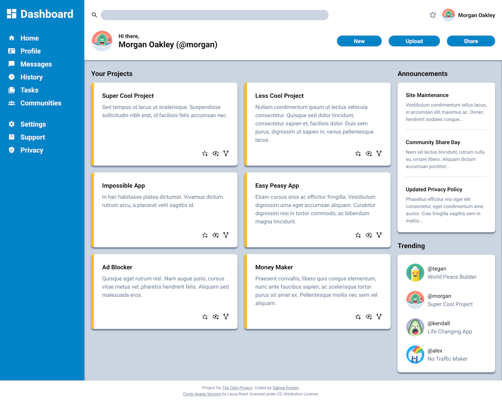

# The Odin Project - Admin dashboard solution

This is a solution to [Project: Admin Dashboard for the Odin Project](https://www.theodinproject.com/lessons/node-path-intermediate-html-and-css-admin-dashboard). The Odin Project provides a free open-source coding curriculum that can be taken entirely online.

Project: Admin Dashboard is one of two projects in the [Intermediate HTML and CSS Course](https://www.theodinproject.com/paths/full-stack-javascript/courses/intermediate-html-and-css). It provides an opportunity to practice building layouts with CSS Grid.

## Table of contents

- [Overview](#overview)
  - [Screenshot](#screenshot)
  - [Links](#links)
- [My process](#my-process)
  - [Built with](#built-with)
  - [What I learned](#what-i-learned)
  - [Continued development](#continued-development)
  - [Useful resources](#useful-resources)
- [Author](#author)
- [Acknowledgments](#acknowledgments)

## Overview

The brief for this project was to build out an admin dashboard similar to the one in the [design file](https://github.com/SabineEmden/odin-admin-dashboard/blob/main/design/design.png), using CSS Grid for the majority of the layout work.

### Screenshot



### Links

- [GitHub repository](https://github.com/SabineEmden/odin-admin-dashboard)
- [Live site](https://sabineemden.github.io/odin-admin-dashboard/)

## My process

### Build with

- Semantic HTML
- CSS Grid
- CSS Flexbox
- SVG icons

### What I learned

I used CSS Grid to lay out the sidebar, header, and main-content containers within the `<main>` element:

```css
main {
  flex: 1;
  display: grid;
  grid-template-columns: max-content 1fr;
  grid-template-rows: auto 1fr;
}

/* ... */

.sidebar {
  grid-row: 1 / 3;
  /* ...*/
}
```

In the header, I laid out the search bar, user info, and buttons with Grid:

```css
.header {
  display: grid;
  grid-template-columns: minmax(13rem, 3fr) minmax(10rem, 2fr);
  gap: 24px;
  /* ... */
}
```

For the main content, I used nested grids to lay out the projects, announcements, and trending items:

```css
.main-content {
  display: grid;
  grid-template-columns: 3fr minmax(15rem, 1fr);
  /* ... */
}

/* ... */

.project-grid {
  display: grid;
  grid-template-columns: repeat(auto-fit, minmax(18rem, 1fr));
  gap: 20px;
  align-items: stretch;
  /* ... */
}
```

I did not use grids to lay out the navigation and branding sections in the sidebar. I wanted the SVG icons to be part of the links. Using inline SVGs allows them to change color when the links are active. Nesting the links in an unordered list within a `<nav>` element improves their accessibility with screen readers.

### Continued development

With the exception of ARIA attributes, I only used HTML and CSS features that were covered in the curriculum of the [Full Stack JavaScript learning path](https://www.theodinproject.com/paths/full-stack-javascript) up to this project.

Responsive design is not covered until much later in the curriculum. I made my solution as responsive as possible with the tools I had available, using CSS Grid and Flexbox, but no media queries. For mobile screens, the design would have to change significantly, for example by changing the sidebar to a hamburger menu.

Web accessibility is also covered much later in the curriculum. I used what I have learned about accessibility while working on [Frontend Mentor challenges](https://www.frontendmentor.io/).

### Useful resources

For this project, I spent more time on the SVG icons than on Grid or Flexbox. Here are the resources I used to make the icons interactive and accessible:

- [Icons](https://web.dev/learn/design/icons) in Learn Responsive Design on web.dev - This article was the starting point for my deep dive into working with SVG icons.
- [Accessible icon links](https://kittygiraudel.com/2020/12/10/accessible-icon-links/) by Kitty Giraudel - This article is a step-by-step guide on how to implement a link with an SVG icon without text and make it accessible.
- [Accessible Icon Buttons](https://www.sarasoueidan.com/blog/accessible-icon-buttons/) by Sara Soueidan - This article discusses server options buttons with SVG icons, with and without text. I chose technique #1: accessible visually hidden text for the "watch" buttons on the project cards.
- [Inclusively Hidden](https://www.scottohara.me/blog/2017/04/14/inclusively-hidden.html#hiding-content-visually) by Scott O'Hara - This article helped me with the CSS for the "sr-only" class on the SVG icon buttons and links.

## Author

Find me online:

- Personal Website - [Sabine Emden](https://www.sabineemden.com/)
- Mastodon - [@sabineemden](https://mastodon.online/@sabineemden)

## Acknowledgements

This solution uses Josh Comeau's [CSS reset](https://www.joshwcomeau.com/css/custom-css-reset/).

The font family used in this project is [Roboto](https://fonts.google.com/specimen/Roboto) by Christian Robertson. The fonts are licensed under the [Apache License, Version 2.0](https://www.apache.org/licenses/LICENSE-2.0).

The SVG icons are available from the [Material Design Icons](https://pictogrammers.com/library/mdi/) by Pictogrammers.

The [Circle Avatar Vectors](https://www.svgrepo.com/collection/circle-avatar-vectors/) were created by Laura Reed and are licensed under CC Attribution License.

I took some inspiration from the user interface of [GitHub.com](https://github.com/) to figure out whether the icons on the project cards should be buttons or links.
